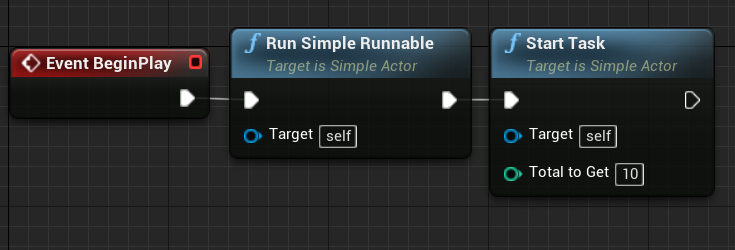
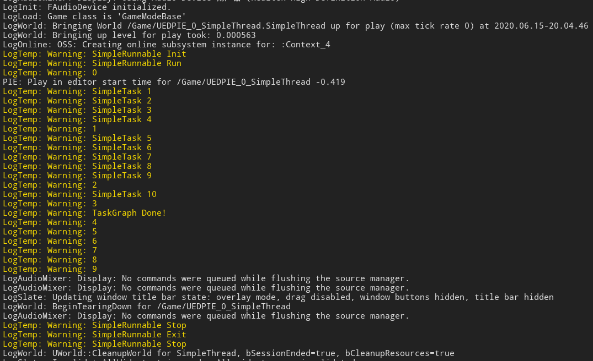
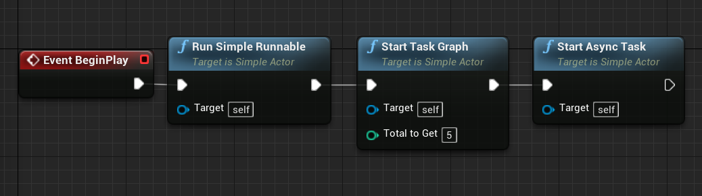
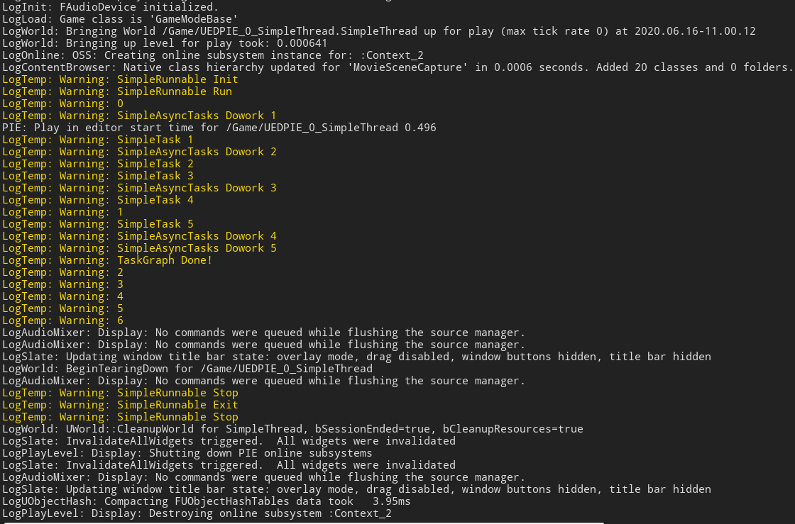
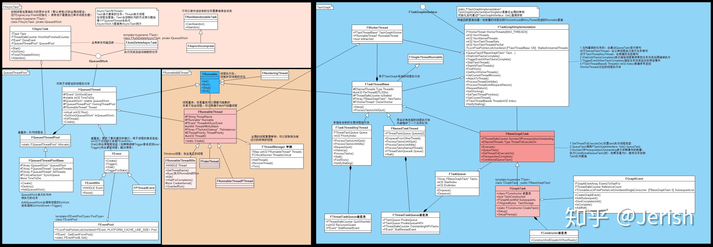

# UE4_MultiThread
UE4.24.3多线程

示例项目：https://github.com/tiax615/UE4_MultiThread

## 0. 背景
UE4大部分工作都是在主线程里完成的，但有些事情可以放在多线程里，所以需要了解多线程。和渲染以及UObject/AActor的创建/修改/销毁有关的事请，应该在主线程完成，否则会崩溃。其他线程可能可以做网络数据收发和解析，数学运算等。

研究过程中发现Rama大佬写的官方Wiki代码比较复杂，其中FRunnable可以运行，但TaskGraphSystem跑不动。以下做一些简化和分析，理解不深，后续需要在使用过程中加深理解。

## 1. 项目结构
```
Content/                                            - 资源文件夹
    Rama/                                           - 官方Wiki尝试
        BP_MultiThreadGameMode
        BP_MyPlayerController
        BP_TestGameMode
        MultiThread
    BP_SimpleActor									- 简化的实现
    SimpleThread									- 简化的实现的地图
Source/                                             - cpp文件夹
    Private/
        MyPlayerController.cpp                      - 命名空间中实现TaskGraph，以及以上FRunnable的使用
        PrimeNumberWorker.cpp                       - 纯cpp类继承FRunnable
        SimpleActor.cpp								- 使用SimpleRunnable的Actor类
        SimpleRunnable.cpp							- FRunnable的一个简单应用
```

## 2. 官方Wiki-Rama
大佬的代码，我看着有点吃力。
### 2.1. FRunnable
详见PrimeNumberWorker.h/PrimeNumberWorker.cpp
### 2.2. TaskGraph
详见MyPlayerController.h/MyPlayerController.cpp

## 3. FRunnable
### 3.1. 最简单的形式
最简单的FRunnable线程实现代码如下，这个能运行，每隔0.5s打印当前Count的值。但是因为只实现了Run()，并且永远循环，所以线程无法退出。就算游戏主线程停止了，这个线程还在继续运行。

如果Run()中的方法不是永远循环的，就可以直接退出。

SimpleRunnable.h
```
#include "CoreMinimal.h"
#include "HAL/Runnable.h"

class FSimpleRunnable :public FRunnable
{
public:
	FSimpleRunnable();
	~FSimpleRunnable();

private:
	// 必须实现的几个
	virtual bool Init() override;
	virtual uint32 Run() override;
	virtual void Stop() override;
	virtual void Exit() override;
};
```

只实现了一个简单的Run()，一直循环每隔0.5s打印Count的值，并且Count++。头文件PlayerController.h是为了使用FPlatformProcess::Sleep()。

SimpleRunnable.cpp
```
#include "SimpleRunnable.h"
#include "GameFramework\PlayerController.h"
//#include "Windows\WindowsPlatformProcess.h"

FSimpleRunnable::FSimpleRunnable() {}

FSimpleRunnable::~FSimpleRunnable() {}

bool FSimpleRunnable::Init() { return true; }

uint32 FSimpleRunnable::Run()
{
	int Count = 0;
	while (true)
	{
		UE_LOG(LogTemp, Warning, TEXT("%d"), Count++);
		FPlatformProcess::Sleep(0.5);
	}
	return 0;
}

void FSimpleRunnable::Stop() {}

void FSimpleRunnable::Exit() {}
```

以上实现了一个FRunnable，但还没有去调用，需要在主线程调用。这里新建了一个Actor类SimpleActor，在新增的RunSimpleRunnable()中调用。需要包含HAL/RunnableThread.h。

SimpleActor.cpp
```
#include "SimpleActor.h"
#include "HAL/RunnableThread.h"
#include "SimpleRunnable.h"

//...

void ASimpleActor::RunSimpleRunnable()
{
	FRunnable* SimpleRunnable = new FSimpleRunnable();
	FRunnableThread* SimpleRunnableThread = FRunnableThread::Create(SimpleRunnable, TEXT("MySimpleRunnable"));
}
```

使用的时候出现一个奇怪的现象，每次打印的不是连续的整数，而是每个数都多加了1。可能是UE_LOG里，Count++执行了两次。


### 3.2. 改进
#### 3.2.1. 创建和释放
以上最简单的形式，只是能把FRunnable用起来，还差很多东西，参考官方Wiki稍作说明和简化。

为了方便创建线程，在SimpleRunnable类中定义静态单例MySimpleRunnable，这个线程只能创建一次。和存放线程的指针MyRunnableThread，以便在合适的时候释放掉。UE4中纯C++类需要手动管理内存。

包含头文件HAL/Runnable.h和HAL/RunnableThread.h。初始化MySimpleRunnable为nullptr，在构造函数中Create这个MyRunnableThread线程，在析构函数中delete。
```
static FSimpleRunnable* MySimpleRunnable;
class FRunnableThread* MyRunnableThread;

FSimpleRunnable* FSimpleRunnable::MySimpleRunnable = nullptr;

FSimpleRunnable::FSimpleRunnable()
{
	MyRunnableThread = FRunnableThread::Create(this, TEXT("MySimpleRunnable"));
}

FSimpleRunnable::~FSimpleRunnable()
{
	delete MyRunnableThread;
	MyRunnableThread = nullptr;
}
```

再新增一个静态方法JoyInit，只要包含了SimpleRunnable.h，在任何地方调用都能创建一个SimpleRunnable线程单例。当MySimpleRunnable是空指针并且当前平台支持多线程时，创建新的SimpleRunnable实例并让MySimpleRunnable指向它。
```
static FSimpleRunnable* JoyInit();

FSimpleRunnable* FSimpleRunnable::JoyInit()
{
	if (!MySimpleRunnable && FPlatformProcess::SupportsMultithreading())
	{
		MySimpleRunnable = new FSimpleRunnable();
	}
}
```

#### 3.2.2. 退出
那怎么退出呢。如果Run中的代码执行完了，会自动执行Stop和Exit退出，否则就需要手动去中断。这里使用FThreadSafeCounter这个计数去判断，是否还要继续执行Run的方法，当计数不为0时，结束Run。

在构造时初始化计数StopTaskCounter，将Run中的while(true)改为While(StopTaskCounter.GetValue()==0)。在主线程中，调用SimpleRunnable类的shutdown()就可以主动退出
```
FThreadSafeCounter StopTaskCounter;
void EnsureCompletion();
static void Shutdown();

FSimpleRunnable::FSimpleRunnable():StopTaskCounter(0)
{
	MyRunnableThread = FRunnableThread::Create(this, TEXT("MySimpleRunnable"));
}

void FSimpleRunnable::EnsureCompletion()
{
	Stop();
	MyRunnableThread->WaitForCompletion();
}

uint32 FSimpleRunnable::Run()
{
	UE_LOG(LogTemp, Warning, TEXT("SimpleRunnable Run"));

	int Count = 0;
	while (StopTaskCounter.GetValue()==0)
	{
		UE_LOG(LogTemp, Warning, TEXT("%d"), Count);
		Count++;
		FPlatformProcess::Sleep(0.5);
	}
	return 0;
}

void FSimpleRunnable::Stop()
{
	UE_LOG(LogTemp, Warning, TEXT("SimpleRunnable Stop"));
	StopTaskCounter.Increment();
}

void FSimpleRunnable::Shutdown()
{
	if (MySimpleRunnable)
	{
		MySimpleRunnable->EnsureCompletion();
		delete MySimpleRunnable;
		MySimpleRunnable = nullptr;
	}
}
```

#### 3.2.3. 使用
还是在SimpleActor中，实现SimRunnable的使用。

SimpleActor.h，声明蓝图可调用的方法RunSimpleRunnable()和StopSimpleRunnable()，用于开启和停止SimpleRunnable线程。
```
public:	
	UFUNCTION(BlueprintCallable, Category = "SimpleActor")
		void RunSimpleRunnable();

	UFUNCTION(BlueprintCallable, Category = "SimpleActor")
		void StopSimpleRunnable();
```

SimpleActor.cpp，头文件只需要包含SimpleRunnable.h，通过静态方法开启和停止，使用方法非常简单。
```
void ASimpleActor::RunSimpleRunnable()
{
	FSimpleRunnable::JoyInit();
}

void ASimpleActor::StopSimpleRunnable()
{
	FSimpleRunnable::Shutdown();
}
```

新建一个继承自SimpleActor类的蓝图类BP_SimpleActor，EventBeginPlay时使用RunSimpleRunnable，EventEndPlay时使用
StopSimpleRunnable。


Play的时候正常开启了线程，结束游戏的时候也停止了下来。


## 4. TaskGraph
### 4.1. 命名空间
TaskGraph系统是UE4一套抽象的异步任务处理系统，可以创建多个多线程任务。官方Wiki是使用命名空间来做的，这里我简化一下也写了个命名空间，可以用来打印指定个数的整数。

namespace SimpleTaskGraph，内容见代码的注释，这段代码在SimpleActor.cpp中。
```
namespace SimpleTaskGraph
{
	FGraphEventArray SimpleTask_CompletionEvents; // 用于保存任务的数组
	int Number = 0; // 要打印的整数，从0开始

	// Are all tasks complete?
	bool TasksAreComplete()
	{
		for (int32 Index = 0; Index < SimpleTask_CompletionEvents.Num(); Index++)
		{
			if (!SimpleTask_CompletionEvents[Index]->IsComplete())
			{
				return false;
			}
		}
		return true;
	}

	// 打印下一个整数
	int GetNextInt()
	{
		FPlatformProcess::Sleep(0.1);
		Number++;
		UE_LOG(LogTemp, Warning, TEXT("SimpleTask %d"), Number);
		return Number;
	}

	// Each task thread
	class SimpleTask
	{
	public:
		SimpleTask() {}

		// 获取任务的名字，暂时没用到
		static const TCHAR* GetTaskName()
		{
			return TEXT("SimpleTask");
		}

		//////////////////////////////////////////////////////////////////////////
		// 需要实现的方法，没有这些会编译报错。暂时没用到
		FORCEINLINE static TStatId GetStatId()
		{
			RETURN_QUICK_DECLARE_CYCLE_STAT(SimpleTask, STATGROUP_TaskGraphTasks);
		}
		static ESubsequentsMode::Type GetSubsequentsMode()
		{
			return ESubsequentsMode::TrackSubsequents;
		}
		static ENamedThreads::Type GetDesiredThread()
		{
			return ENamedThreads::AnyThread;
		}
		//////////////////////////////////////////////////////////////////////////

		// Main function: DO Task!
		void DoTask(ENamedThreads::Type CurrentThread, const FGraphEventRef& MyCompletionGraphEvent)
		{
			GetNextInt();
		}
	};

	// 使用命名空间SimpleTaskGraph的这个方法，开启任务图
	void GetInts(const uint32 TotalToGet)
	{
		for (uint32 i = 0; i < TotalToGet; i++)
		{
			// 第一个变量等待其中的任务完成，然后再进行下一个任务
			// 第一个变量官方Wiki是NULL，这样可以不按照顺序执行
			SimpleTask_CompletionEvents.Add(TGraphTask<SimpleTask>::CreateTask(
				&SimpleTask_CompletionEvents, ENamedThreads::GameThread).ConstructAndDispatchWhenReady());
		}
	}
}
```

### 4.2. 使用
这里参照了官方Wiki的写法，在StartTask()中开启任务图，用计时器每隔1s检查是否所有任务执行完了。在CheckAllTasksDone()中，如果所有任务执行完了，也就是SimpleTaskGraph::TasksAreComplete()==true，就清除StartTask()中开启的计时器，并且打印任务图完成。

SimpleActor.h，声明计时器句柄，开启任务图和检查任务图是否完成的方法。
```
public:
	UFUNCTION(BlueprintCallable, Category = "SimpleActor")
		void StartTask(int TotalToGet);

private:
	void CheckAllTasksDone();

	FTimerHandle MyTimerHandle;
```

SimpleActor.cpp，需要包含头文件TimerManager.h
```
void ASimpleActor::StartTask(int TotalToGet)
{
	SimpleTaskGraph::GetInts(TotalToGet);
	GetWorldTimerManager().SetTimer(MyTimerHandle, this, &ASimpleActor::CheckAllTasksDone, 1, true);
}

void ASimpleActor::CheckAllTasksDone()
{
	if (SimpleTaskGraph::TasksAreComplete())
	{
		GetWorldTimerManager().ClearTimer(MyTimerHandle);
		UE_LOG(LogTemp, Warning, TEXT("TaskGraph Done!"));
	}
}
```

在蓝图BP_SimpleActor中，EventBeginPlay后连上StartTask，开启任务图，和之前的SimpleRunnable可以比较一下。



运行结果如下，可见SimpleTask按照顺序进行，完成之后打印了 TaskGraph Done!



## 5. AsyncTasks
除了以上的“标准多线程”FRunnable和任务图系统TaskGraph，还有AsyncTasks也能实现不阻塞主线程而异步干事情。我们可以使用FAsyncTask或者FAutoDeleteAsyncTask。使用FAsyncTask 时，我们需要手动停止或删除任务；使用FAutoDeleteAsyncTask时，系统则会自动在任务结束后，删除任务。

### 5.1. 类
这次在SimpleActor中新建了一个类FSimpleAsyncTasks，继承自FNonAbandonableTask类，友元类FAutoDeleteAsyncTask。

SimpleActor.h中FSimpleAsyncTasks类的声明如下，可以接收两个输入。
```
class FSimpleAsyncTasks : public FNonAbandonableTask
{
	friend class FAutoDeleteAsyncTask<FSimpleAsyncTasks>;
public:
	FSimpleAsyncTasks(int32 Input1, int32 Input2);

protected:
	int32 MyInput1;
	int32 MyInput2;
	void DoWork();
	FORCEINLINE TStatId GetStatId() const;
};
```

SimpleActor.cpp中的实现如下，GetStatId()没有直接使用，但是必须的，类似TaskGraph。DoWork()中实现业务逻辑，这里每隔0.2s打印一个从1递增的整数直到5
```
FSimpleAsyncTasks::FSimpleAsyncTasks(int32 Input1, int32 Input2) :
	MyInput1(Input1),
	MyInput2(Input2)
{
}

void FSimpleAsyncTasks::DoWork()
{
	for (int i = 1; i < 6; i++)
	{
		UE_LOG(LogTemp, Warning, TEXT("SimpleAsyncTasks Dowork %d"),i);
		FPlatformProcess::Sleep(0.2);
	}
}

FORCEINLINE TStatId FSimpleAsyncTasks::GetStatId() const
{
	RETURN_QUICK_DECLARE_CYCLE_STAT(FSimpleAsyncTasks, STATGROUP_ThreadPoolAsyncTasks);
}
```

### 5.2. 使用
同样在SimpleActor中使用，新增方法StartAsyncTask()。
```
UFUNCTION(BlueprintCallable, Category = "SimpleActor")
		void StartAsyncTask();

void ASimpleActor::StartAsyncTask()
{
	// Instantiate a copy of the actual task, and queue the task for execution with StartBackgroundTask()
	(new FAutoDeleteAsyncTask<FSimpleAsyncTasks>(6,6))->StartBackgroundTask();
}
```

同样在蓝图BP_SimpleActor的EventBeginPlay中连上StartAsyncTask，运行结果如下。可以看到FRunnable，TaskGraph，AsyncTasks各自异步运行，没有影响到主线程。





### 6. 总结
FRunnable“标准”多线程，会带来更多的开销，但适合长期连续的操作。

TaskGraph和AsyncTasks是对已有线程的复用。

TaskGraph不适合做计算量大的操作，可能带来严重的卡顿，因为Tick是在TaskGraph中做的。同时也可以将任务分给其他线程执行，可以设置任务依赖顺序。

AsyncTasks类似TaskGraph，但更简洁。AsyncTask系统实现的多线程与你自己继承FRunnable实现的原理相似，不过他在用法上比较简单，而且还可以直接借用UE4提供的线程池，很方便。

借用知乎大佬的图，描述了多线程相关类的关系，可以参考。



## 999. 参考资料
1. 官方Wiki，作者Rama https://www.ue4community.wiki/Legacy/Multi-Threading:_How_to_Create_Threads_in_UE4
2. 官方Wiki，作者Rama https://www.ue4community.wiki/Legacy/Multi-Threading:_Task_Graph_System
3. 官方Wiki，作者不详 https://www.ue4community.wiki/Legacy/Using_AsyncTasks
3. UE4 C++基础教程-多线程，蓝子悠悠 https://zhuanlan.zhihu.com/p/133921916
4. 《Exploring in UE4》多线程机制详解[原理分析] https://zhuanlan.zhihu.com/p/38881269
5. https://www.cnblogs.com/mcomco/p/11316803.html