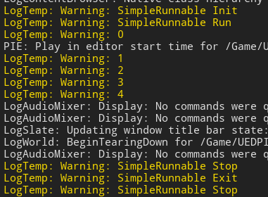

# UE4_MultiThread
UE4.24.3多线程

示例项目：https://github.com/tiax615/UE4_MultiThread

## 0. 背景
UE4大部分工作都是在主线程里完成的，但有些事情可以放在多线程里，所以需要了解多线程。和渲染以及UObject/AActor的创建/修改/销毁有关的事请，应该在主线程完成，否则会崩溃。其他线程可能可以做网络数据收发和解析，数学运算等。

研究过程中发现Rama大佬写的官方Wiki代码比较复杂，其中FRunnable可以运行，但TaskGraphSystem跑不动。也许使用UE4多线程，应从简单的入手，了解本质。

## 1. 项目结构
```
Content/                                            - 资源文件夹
    Rama/                                           - 官方Wiki尝试
        BP_MultiThreadGameMode
        BP_MyPlayerController
        BP_TestGameMode
        MultiThread
Source/                                             - cpp文件夹
    Private/
        PrimeNumberWorker.cpp                       - 纯cpp类继承FRunnable
        MyPlayerController.cpp                      - 命名空间中实现TaskGraph，以及以上FRunnable的使用
```

## 2. 官方Wiki
大佬的代码，我看着有点吃力。
### 2.1. FRunnable
详见PrimeNumberWorker.h/PrimeNumberWorker.cpp
### 2.2. TaskGraph
详见MyPlayerController.h/MyPlayerController.cpp

## 3. FRunnable
### 3.1. 最简单的形式
最简单的FRunnable线程实现代码如下，这个能运行，每隔0.5s打印当前Count的值。但是因为只实现了Run()，并且永远循环，所以线程无法退出。就算游戏主线程停止了，这个线程还在继续运行。

如果Run()中的方法不是永远循环的，就可以直接退出。

SimpleRunnable.h
```
#include "CoreMinimal.h"
#include "HAL/Runnable.h"

class FSimpleRunnable :public FRunnable
{
public:
	FSimpleRunnable();
	~FSimpleRunnable();

private:
	// 必须实现的几个
	virtual bool Init() override;
	virtual uint32 Run() override;
	virtual void Stop() override;
	virtual void Exit() override;
};
```

只实现了一个简单的Run()，一直循环每隔0.5s打印Count的值，并且Count++。头文件PlayerController.h是为了使用FPlatformProcess::Sleep()。

SimpleRunnable.cpp
```
#include "SimpleRunnable.h"
#include "GameFramework\PlayerController.h"
//#include "Windows\WindowsPlatformProcess.h"

FSimpleRunnable::FSimpleRunnable() {}

FSimpleRunnable::~FSimpleRunnable() {}

bool FSimpleRunnable::Init() { return true; }

uint32 FSimpleRunnable::Run()
{
	int Count = 0;
	while (true)
	{
		UE_LOG(LogTemp, Warning, TEXT("%d"), Count++);
		FPlatformProcess::Sleep(0.5);
	}
	return 0;
}

void FSimpleRunnable::Stop() {}

void FSimpleRunnable::Exit() {}
```

以上实现了一个FRunnable，但还没有去调用，需要在主线程调用。这里新建了一个Actor类SimpleActor，在新增的RunSimpleRunnable()中调用。需要包含HAL/RunnableThread.h。

SimpleActor.cpp
```
#include "SimpleActor.h"
#include "HAL/RunnableThread.h"
#include "SimpleRunnable.h"

//...

void ASimpleActor::RunSimpleRunnable()
{
	FRunnable* SimpleRunnable = new FSimpleRunnable();
	FRunnableThread* SimpleRunnableThread = FRunnableThread::Create(SimpleRunnable, TEXT("MySimpleRunnable"));
}
```

使用的时候出现一个奇怪的现象，每次打印的不是连续的整数，而是每个数都多加了1。可能是UE_LOG里，Count++执行了两次。


## 3.2. 改进
### 3.2.1. 创建和释放
以上最简单的形式，只是能把FRunnable用起来，还差很多东西，参考官方Wiki稍作说明和简化。

为了方便创建线程，在SimpleRunnable类中定义静态单例MySimpleRunnable，这个线程只能创建一次。和存放线程的指针MyRunnableThread，以便在合适的时候释放掉。UE4中纯C++类需要手动管理内存。

包含头文件HAL/Runnable.h和HAL/RunnableThread.h。初始化MySimpleRunnable为nullptr，在构造函数中Create这个MyRunnableThread线程，在析构函数中delete。
```
static FSimpleRunnable* MySimpleRunnable;
class FRunnableThread* MyRunnableThread;

FSimpleRunnable* FSimpleRunnable::MySimpleRunnable = nullptr;

FSimpleRunnable::FSimpleRunnable()
{
	MyRunnableThread = FRunnableThread::Create(this, TEXT("MySimpleRunnable"));
}

FSimpleRunnable::~FSimpleRunnable()
{
	delete MyRunnableThread;
	MyRunnableThread = nullptr;
}
```

再新增一个静态方法JoyInit，只要包含了SimpleRunnable.h，在任何地方调用都能创建一个SimpleRunnable线程单例。当MySimpleRunnable是空指针并且当前平台支持多线程时，创建新的SimpleRunnable实例并让MySimpleRunnable指向它。
```
static FSimpleRunnable* JoyInit();

FSimpleRunnable* FSimpleRunnable::JoyInit()
{
	if (!MySimpleRunnable && FPlatformProcess::SupportsMultithreading())
	{
		MySimpleRunnable = new FSimpleRunnable();
	}
}
```

### 3.2.2. 退出
那怎么退出呢。如果Run中的代码执行完了，会自动执行Stop和Exit退出，否则就需要手动去中断。这里使用FThreadSafeCounter这个计数去判断，是否还要继续执行Run的方法，当计数不为0时，结束Run。

在构造时初始化计数StopTaskCounter，将Run中的while(true)改为While(StopTaskCounter.GetValue()==0)。在主线程中，调用SimpleRunnable类的shutdown()就可以主动退出
```
FThreadSafeCounter StopTaskCounter;
void EnsureCompletion();
static void Shutdown();

FSimpleRunnable::FSimpleRunnable():StopTaskCounter(0)
{
	MyRunnableThread = FRunnableThread::Create(this, TEXT("MySimpleRunnable"));
}

void FSimpleRunnable::EnsureCompletion()
{
	Stop();
	MyRunnableThread->WaitForCompletion();
}

uint32 FSimpleRunnable::Run()
{
	UE_LOG(LogTemp, Warning, TEXT("SimpleRunnable Run"));

	int Count = 0;
	while (StopTaskCounter.GetValue()==0)
	{
		UE_LOG(LogTemp, Warning, TEXT("%d"), Count);
		Count++;
		FPlatformProcess::Sleep(0.5);
	}
	return 0;
}

void FSimpleRunnable::Stop()
{
	UE_LOG(LogTemp, Warning, TEXT("SimpleRunnable Stop"));
	StopTaskCounter.Increment();
}

void FSimpleRunnable::Shutdown()
{
	if (MySimpleRunnable)
	{
		MySimpleRunnable->EnsureCompletion();
		delete MySimpleRunnable;
		MySimpleRunnable = nullptr;
	}
}
```

### 3.2.3. 使用
还是在SimpleActor中，实现SimRunnable的使用。

SimpleActor.h，声明蓝图可调用的方法RunSimpleRunnable()和StopSimpleRunnable()，用于开启和停止SimpleRunnable线程。
```
public:	
	UFUNCTION(BlueprintCallable, Category = "SimpleActor")
		void RunSimpleRunnable();

	UFUNCTION(BlueprintCallable, Category = "SimpleActor")
		void StopSimpleRunnable();
```

SimpleActor.cpp，头文件只需要包含SimpleRunnable.h，通过静态方法开启和停止，使用方法非常简单。
```
void ASimpleActor::RunSimpleRunnable()
{
	FSimpleRunnable::JoyInit();
}

void ASimpleActor::StopSimpleRunnable()
{
	FSimpleRunnable::Shutdown();
}
```

新建一个继承自SimpleActor类的蓝图类BP_SimpleActor，EventBeginPlay时使用RunSimpleRunnable，EventEndPlay时使用
StopSimpleRunnable。


Play的时候正常开启了线程，结束游戏的时候也停止了下来。



## 999. 参考资料
1. 官方Wiki，作者Rama https://www.ue4community.wiki/Legacy/Multi-Threading:_How_to_Create_Threads_in_UE4
2. 官方Wiki，作者Rama https://www.ue4community.wiki/Legacy/Multi-Threading:_Task_Graph_System
3. UE4 C++基础教程-多线程，蓝子悠悠 https://zhuanlan.zhihu.com/p/133921916